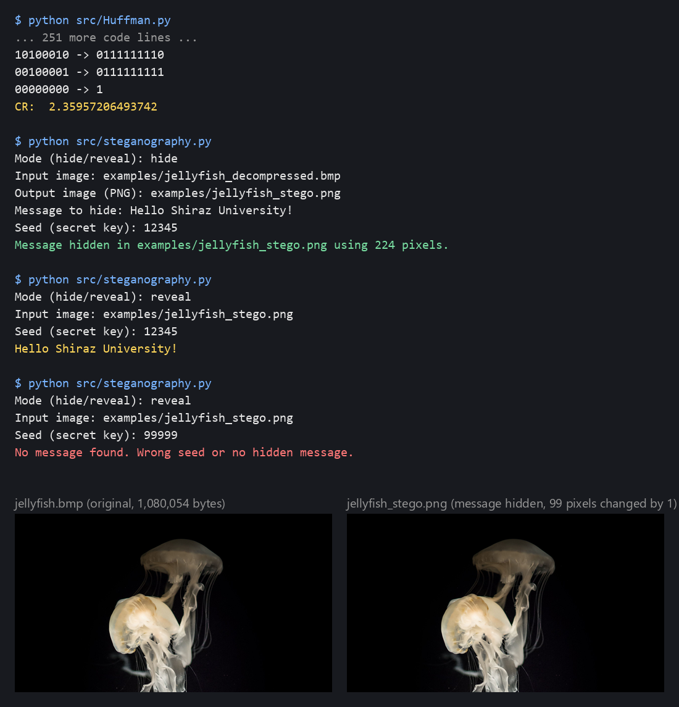

# Huffman Image Compression and LSB Steganography

Lossless image compression with Huffman coding, then a secret message hidden in the image with seeded LSB steganography.



[](LICENSE)

## Overview

Raw images take a lot of space, and sometimes an image also has to carry a message that only one receiver can read. This project answers both needs with two small Python scripts: one compresses a file losslessly with Huffman coding and decompresses it back byte for byte, the other hides a text message in the least significant bits of pixels chosen by a secret seed. It was written for the Algorithm Design course at Shiraz University (Fall 2022). The assignment and the accompanying article, co-written with Pardis Basiri, are in `docs/`.

## Features

- Lossless Huffman compression of any file, with the decompressed output verified identical to the input.
- Huffman code table saved to a text file, one `byte -> code` line per symbol.
- Compression ratio (CR) printed after every run.
- LSB steganography keyed by a seed: pixel positions come from a seeded random permutation, so the message cannot be located without the seed.
- A reveal mode for the receiver, who needs only the image and the seed. A wrong seed reports "no message found" instead of garbage.

## How it works

**Compression (`src/Huffman.py`).** The image file is read as bytes and the frequency of each byte value is counted. A min-heap repeatedly merges the two least frequent nodes until one tree remains; walking the tree assigns shorter codes to more frequent bytes. The file is rewritten as a stream of these codes, padded to a whole number of bytes. The first byte of the compressed file records how many padding bits were added. Decompression reads that header, strips the padding, and matches prefix codes bit by bit to rebuild the original bytes.

**Steganography (`src/steganography.py`).** The message is converted to bits, preceded by a 32-bit header holding its length. The seed initialises Python's random generator, which shuffles the list of all pixel indices. Each bit replaces the least significant bit of the red channel of the next pixel in that order. The result is saved as PNG so the bits survive. The receiver repeats the shuffle with the same seed, reads the header, then reads exactly that many bits back. With a different seed the pixel order is different, so the header is nonsense and the script reports that no message was found.

## Results

Run on `examples/jellyfish.bmp` (800 x 450, RGB, uncompressed):

| Item | Value |
|---|---|
| Original size | 1,080,054 bytes |
| Compressed size (`jellyfish_compressed.bin`) | 457,734 bytes |
| Compression ratio | 2.36 |
| Decompressed file | identical to original (`cmp` reports no difference) |
| Distinct byte values / codes | 254, code lengths 1 to 15 bits |

The dark background means a few byte values dominate, which is exactly what Huffman exploits. On an already compressed input such as a JPEG the ratio drops to about 1.0, because JPEG has removed that redundancy itself.

Hiding the 24-character message `Hello Shiraz University!` with seed `12345`:

| Item | Value |
|---|---|
| Hidden bits | 224 (32-bit length header + 192 message bits) |
| Pixels changed | 99 out of 360,000 |
| Largest change per channel | 1 |
| Output | `examples/jellyfish_stego.png`, decodes back to the exact message |

## Getting started

Prerequisites: Python 3.9 or newer and git.

```bash
git clone https://github.com/matinmonshizadeh/Image-Compression-Huffman-coding-technique.git
cd Image-Compression-Huffman-coding-technique
python -m venv .venv
.venv\Scripts\activate        # Windows; on macOS/Linux: source .venv/bin/activate
pip install -r requirements.txt
```

Compress and decompress the sample image (under a second):

```bash
python src/Huffman.py
```

This writes `jellyfish_compressed.bin`, `jellyfish_decompressed.bmp`, and `huffman_codes.txt` into `examples/` and prints the CR. To try another image, save it as BMP in `examples/` and change `INPUT_IMAGE` at the top of the script.

Hide or reveal a message. The script first asks for the mode. In `hide` mode it asks for the input image (use the decompressed image from the previous step), the output PNG, the message, and the seed. In `reveal` mode it asks only for the image and the seed:

```bash
python src/steganography.py
```

## Project structure

```
.
├── src/
│   ├── Huffman.py               # compress, save code table, decompress, print CR
│   └── steganography.py         # hide or reveal a message (LSB, seeded)
├── examples/
│   ├── jellyfish.bmp            # sample input (uncompressed)
│   ├── jellyfish_compressed.bin # sample compressed output
│   ├── huffman_codes.txt        # sample code table
│   └── jellyfish_stego.png      # sample image with hidden message
├── docs/                        # assignment PDF, article PDF, demo image
├── requirements.txt
└── LICENSE
```

## Limitations and future work

- Huffman works on raw file bytes, so it only pays off for uncompressed formats such as BMP. On JPEG or PNG input the ratio is about 1.0. Decoding the pixels first would make it format independent.
- The compression script has a fixed input path, and the message must fit in one bit per pixel. Only the red channel is used, so capacity is a third of what LSB could offer.
- The code table is not stored inside the compressed file, so decompression only works in the same run that built the tree. A standalone decompressor would need the table written as a header.

## License

MIT. See [LICENSE](LICENSE).
